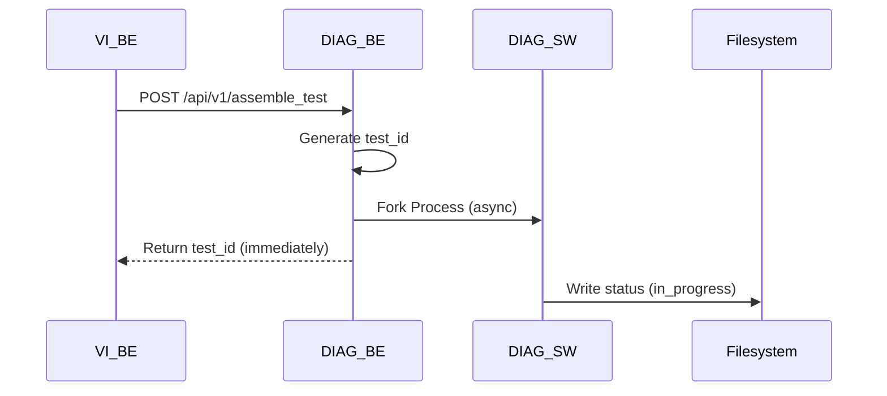

# Operation 1: Assemble Test (Initiator: VI_BE)

```mermaid
sequenceDiagram
    participant VI_BE
    participant DIAG_BE
    participant DIAG_SW
    
    VI_BE->>DIAG_BE: POST /api/v1/assemble_test
    DIAG_BE->>DIAG_BE: Generate test_id
    DIAG_BE->>DIAG_SW: Fork Process (async)
    DIAG_BE-->>VI_BE: Return test_id (immediately)
    DIAG_SW->>Filesystem: Write status (in_progress)
```
