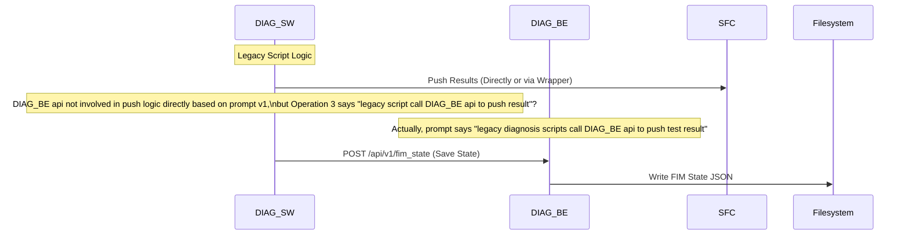

# Operation 3: Push Result (Initiator: DIAG_SW)

```mermaid
sequenceDiagram
    participant DIAG_SW
    participant DIAG_BE
    participant SFC
    
    Note over DIAG_SW: Legacy Script Logic
    DIAG_SW->>SFC: Push Results (Directly or via Wrapper)
    Note over DIAG_SW: DIAG_BE api not involved in push logic directly based on prompt v1,\nbut Operation 3 says "legacy script call DIAG_BE api to push result"?
    Note over DIAG_BE: Actually, prompt says "legacy diagnosis scripts call DIAG_BE api to push test result"
    
    DIAG_SW->>DIAG_BE: POST /api/v1/fim_state (Save State)
    DIAG_BE->>Filesystem: Write FIM State JSON
```
