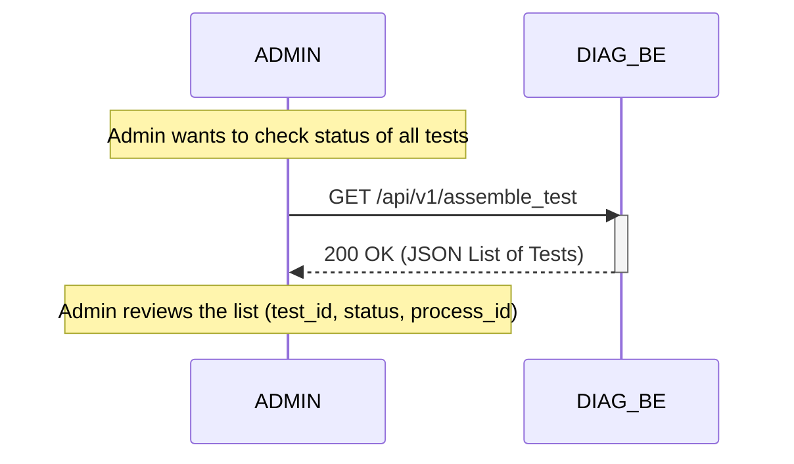

# Operation Sequence: Admin Monitor Assemble Test

This document describes the sequence of interactions for the Admin to monitor all running assemble test processes.

## Participants
- **ADMIN**: The system administrator.
- **DIAG_BE**: The Diagnosis Backend Service.

## Sequence Diagram

## detailed steps
1. **ADMIN** sends a `GET` request to `/api/v1/assemble_test`.
2. **DIAG_BE** scans the `scripts` directory for tracking files.
3. **DIAG_BE** returns a list of all assemble tests with their current status.
