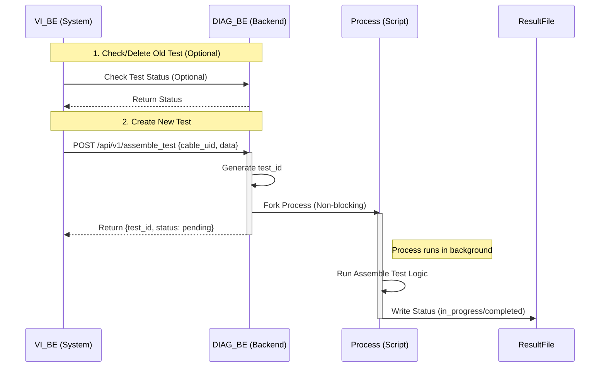
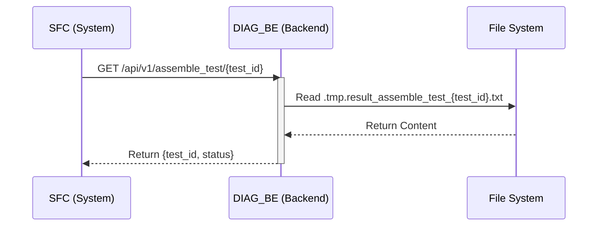

# Operation Sequence Diagrams / 操作時序圖

## Operation 1: Assemble Test / 線纜組裝測試
**Initiator / 發起者**: Cable Assembly Assist System (VI_BE)

## Operation 2: Get Status / 獲取狀態
**Initiator / 發起者**: Shop Floor System (SFC)

