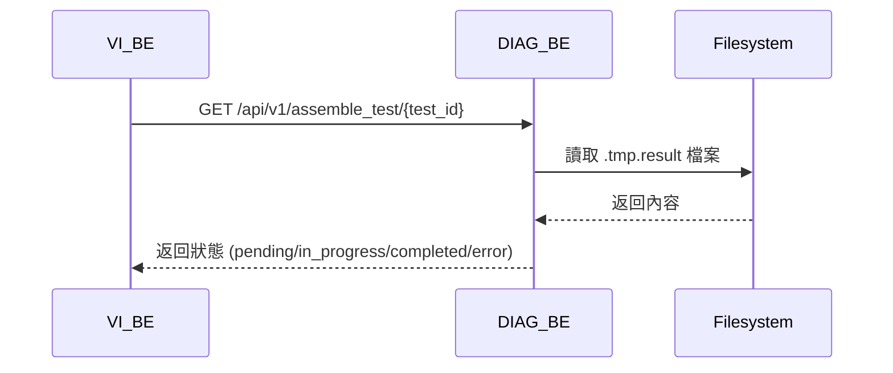

# Operation 2: Check Status (Initiator: VI_BE)

```mermaid
sequenceDiagram
    participant VI_BE
    participant DIAG_BE
    participant Filesystem
    
    VI_BE->>DIAG_BE: GET /api/v1/assemble_test/{test_id}
    DIAG_BE->>Filesystem: 讀取 .tmp.result 檔案
    Filesystem-->>DIAG_BE: 返回內容
    DIAG_BE-->>VI_BE: 返回狀態 (pending/in_progress/completed/error)
```
