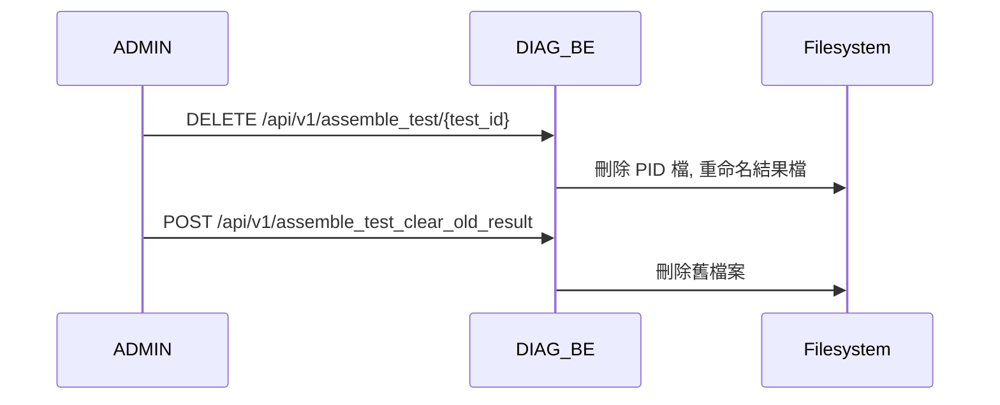

# Operation 4: Admin Ops (Initiator: ADMIN)

```mermaid
sequenceDiagram
    participant ADMIN
    participant DIAG_BE
    participant Filesystem
    
    ADMIN->>DIAG_BE: DELETE /api/v1/assemble_test/{test_id}
    DIAG_BE->>Filesystem: 刪除 PID 檔, 重命名結果檔
    
    ADMIN->>DIAG_BE: POST /api/v1/assemble_test_clear_old_result
    DIAG_BE->>Filesystem: 刪除舊檔案
```
