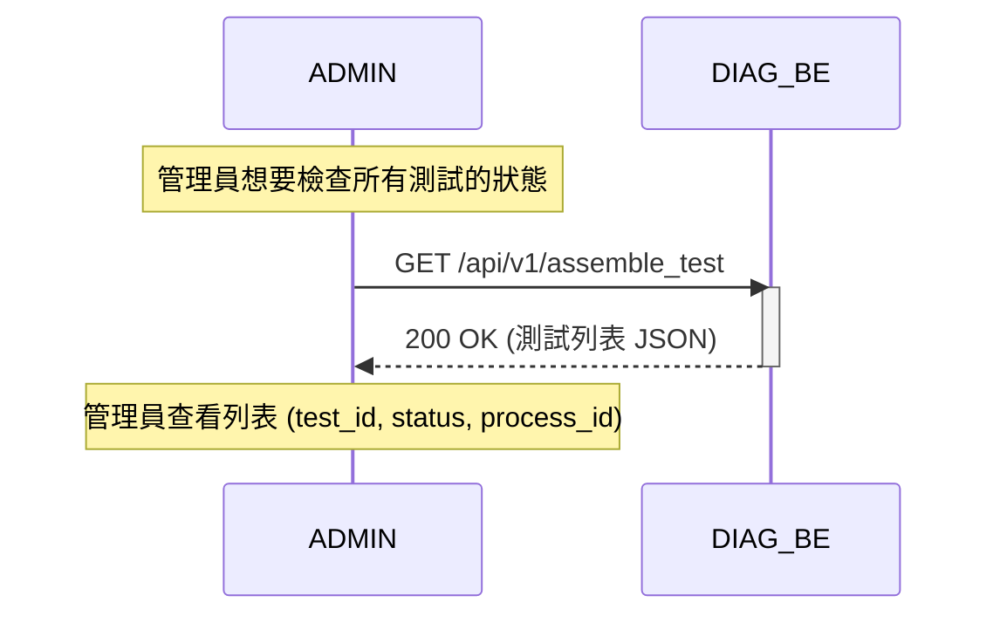

# 操作順序: 管理員監控組裝測試

本文檔描述了管理員監控所有正在運行的組裝測試流程的交互順序。

## 參與者 (Participants)
- **ADMIN**: 系統管理員。
- **DIAG_BE**: AI 診斷後端服務 (Diagnosis Backend Service)。

## 時序圖 (Sequence Diagram)

## 詳細步驟
1. **ADMIN** 發送 `GET` 請求到 `/api/v1/assemble_test`。
2. **DIAG_BE** 掃描 `scripts` 目錄以查找追蹤文件。
3. **DIAG_BE** 返回包含當前狀態的所有組裝測試列表。
